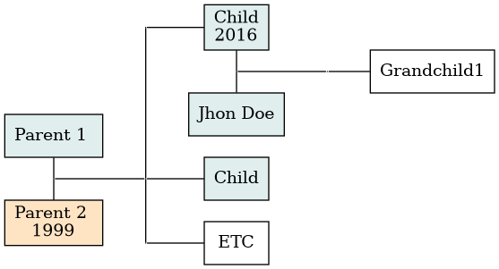

# familytreemaker.sh
Make your own family tree using simple syntax and DOT.
This script will compile a tree file into dot-compatible syntax, leaving it to graph the actual tree.

This program is heavily inspired by [familytreemaker](https://github.com/adrienverge/familytreemaker), though this is not just a sh clone of that project.
The problem I had with [familytreemaker](https://github.com/adrienverge/familytreemaker) is that it started at one ancestor and looped through their children. I however wanted to add the ancestors of my in-laws as well, thus resulting in this program.

## Dependencies
### For complilation

- a posix complient shell
    + printf
    + sed (GNU)
    + grep
    + pcregrep
    + cut

### For the actual graphing
- dot

## Usage
### Syntax
You have to make a tree file with the following syntax, example.tree:
```
Child 1
Inlaw 1 (M,,Jhon Doe)
    Grandchild 1
Parent 1 (M)
Parent 2 (F,1999)
    Child 1 (M,2016,Child)
    Child 2 (M,,Child)
    ETC
```
Two non-indented lines represent a unity between two people referred to as a household.
All lines below a household indented with four spaces are the children from this unity.

Each line consists of a unique identifier with optional tags:
`Identifier (Gender,Birthyear,Name)`

#### Tags
Between brackets, you can add three tags seperated by comma's but always in order:

- Gender (M or F)
    + Colours the box in the final graph
- Birth year
    + Which gets appended on a newline after the name of the person, technically, you can add anything you like here.
- Name
    + If not set, the identifiere will be used as the name

#### Tips
An inmportant thing to notice when it comes to tags is that you should either set them everywhere, or in one place.
What I mean by this is that you cannot at one point define the persons birth-year and at a seperate point define their sex, example:
```
Parent 1 (M,1999)
Parent 2
    Child 1
Grandparent 1
Grandparent 2
    Parent 1 (M)
```
The first and last lines will conflict in this case and the later onee will override the former.

Furhtermore, special characters (such as . , [ ( : & ;) should be avoided as both DOT and familytreemaker.sh will interprent them as special characters.
The string [HOUSEHOLD] is also use internally, therefore, do not include this in your tree file.

Lastly, the final graph tends to look best if you put the youngest generations first.

### Result
After compiling the above file using
`familytreemaker.sh example.tree | dot -Tpng -o example.png`, you get the following image.


DOT can output to many other formats as well, to see all of them check
`man dot`

## Further information
This software is still a  work-in-progress, but it should be usable for simple family tree generation.
Errors in generation can also be fixed by running
`familytreemaker.sh example.tree > example.gv`
and editing the .gv file using a text editor.
For more information on how to work with DOT and .gv files see [Drawing graphs with DOT](https://www.graphviz.org/pdf/dotguide.pdf).
