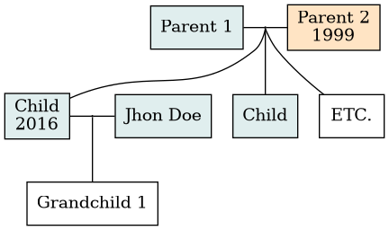

# familytreemaker.sh
Make your own family tree using simple syntax and DOT.

This program is heavily inspired by [familytreemaker](https://github.com/adrienverge/familytreemaker), though this is not just a bash clone of that project.
The problem I had with [familytreemaker](https://github.com/adrienverge/familytreemaker) is that it started at one ancestor and looped through their children. I however wanted to add the ancestors of my in-laws as well, thus resulting in this program.

## Usage
You have to make a tree file with the following syntax
```
Parent 1 (M)
Parent 2 (F, 1999)
    Child 1 (M , 2016)
    Child 2 (M)
    ETC.
Child 1
Inlaw 1
    Grandchild 1
```
Two non-indented lines represent a unity between two people referred to as a household.
All lines below a household indented with four spaces are the children from this unity.

Between brackets, you can add two tags, Gender (M or F) which colours the box in the final graph and birth year (, 1999) which gets appended on a newline after the name of the person.

### Result
After running compiling the above file using
`familytreemaker.sh example.tree | dot -Tpng -o example.png`, you get the following image.


DOT can output to many other formats as well, to see all of them check
`man dot`

## Further information
This software is still a  work-in-progress, but it should be usable for simple family tree generation.
Errors in generation can also be fixed by running
`familytreemaker.sh example.tree > example.gv`
and editing the .gv file using a text editor.
For more information on how to work with DOT and .gv files see [Drawing graphs with DOT](https://www.graphviz.org/pdf/dotguide.pdf).
